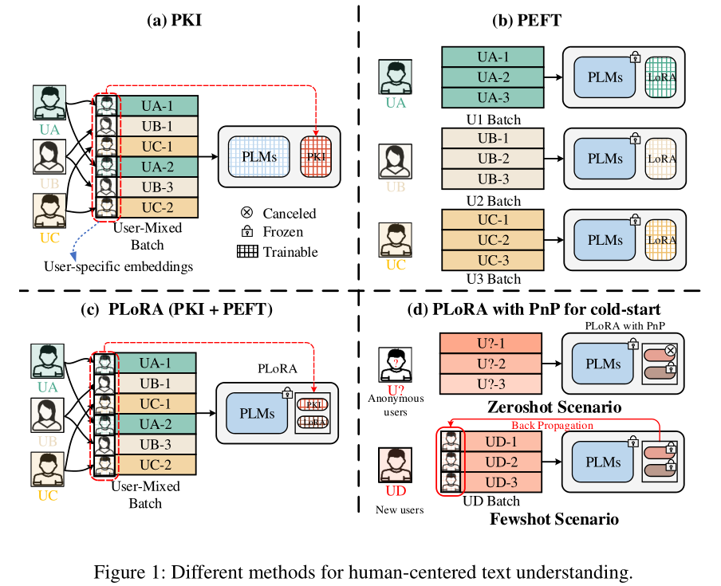

# Personalized LoRA for Human-Centered Text Understanding


 

## Installation
1. download datasets from [here](https://drive.google.com/drive/folders/1KFZtSfLHQ3SKlSh3RM9FBvbRK2zDwZwn?usp=drive_link):

    | dataset | IMDB | YELP | GDRD | PPR |
    | ----------- | ----------- | ----------- | ----------- | ----------- | 
    | original link | [Link](https://drive.google.com/drive/folders/1do6c_kXC4abMgEhbeJ7ObcEdqm78ghAy?usp=sharing) | [Link](https://drive.google.com/drive/folders/1do6c_kXC4abMgEhbeJ7ObcEdqm78ghAy?usp=sharing) | [Link](https://mengtingwan.github.io/data/goodreads) | [Link](https://www.kaggle.com/shuyangli94/food-com-recipes-and-user-interactions) |
    
     and organize data as follows:
    ```commandline
   |--$corpus
   |  |-- imdb2
   |  |  | a
   |  |  | b
   |  |-- yelp2
   |  |  | a
   |  |  | b
   |  |-- gdrd
   |  |  | a
   |  |  | b
   |  |-- ppr
   |  |  | a
   |  |  | b
   ```

2. install required packages:
    ```python
   pip install -r requirement.txt
    ```
## Training and Evaluating
1. config with configuration files:
   ```commandline
   |--$cfgs
   |  |-- {Model}_model.yml # configurations for each base model
   |  |-- config.py # configurations for running settings
   |  |-- constants # constant configurations
   ```

2. training and evaluating on full-shot scenario (e.g., IMDB datasets)

   ```python
   python run.py --run train --version test_fullshot --gpu 0 --dataset imdb2a --model bert
    ```

3. training and evaluating on few-shot scenario (e.g., IMDB datasets)

    ```python
   python run.py --run fewshot --version test_fewshot --gpu 0 --dataset imdb2b --model bert
    ```

4. evaluating on zero-shot scenario (e.g., IMDB datasets)
   ```python
   python run.py --run zeroshot --version test_zeroshot --gpu 0 --dataset imdb2b --model bert
    ```

## Citation

   ```commandline
   awaiting update.
   ```